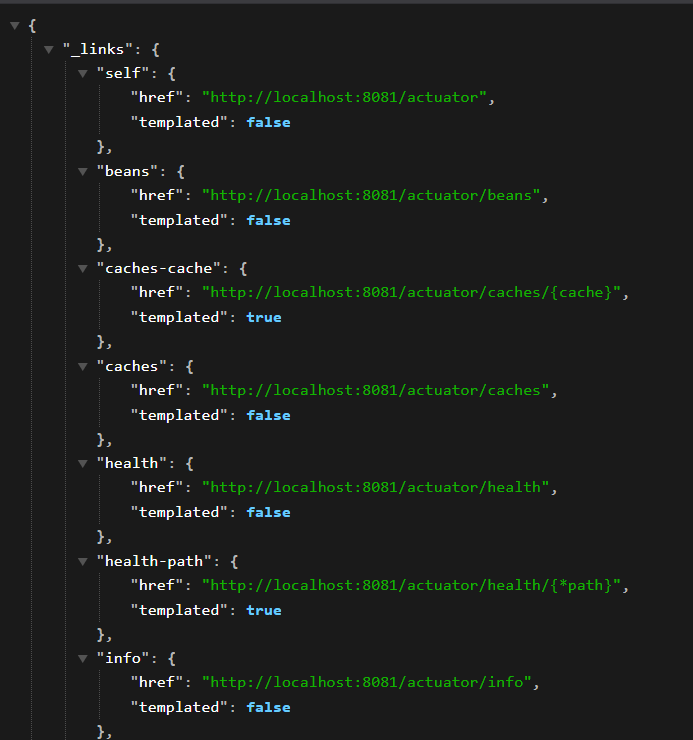
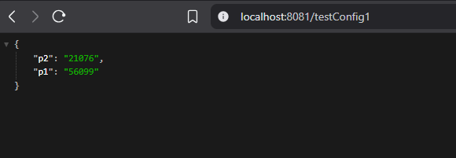
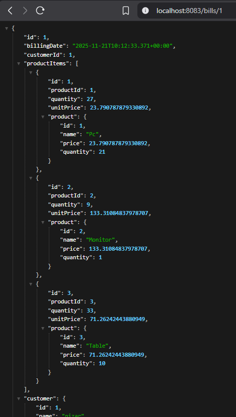
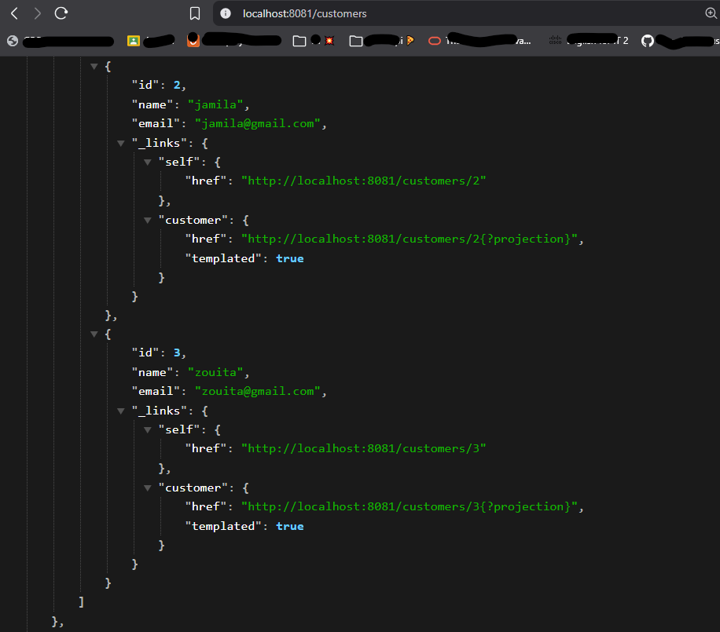
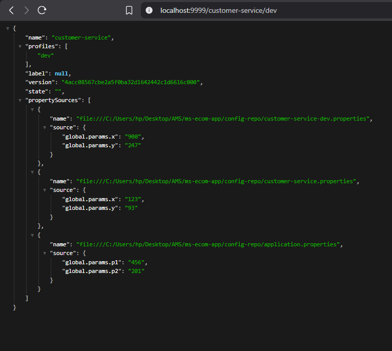
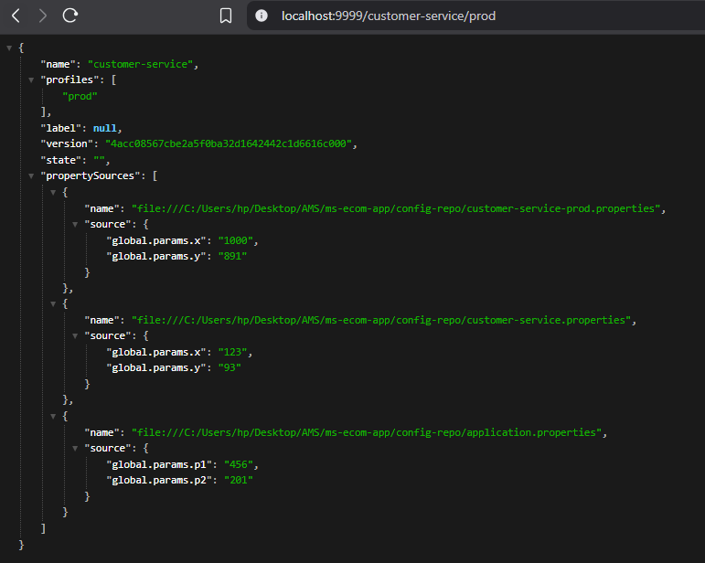
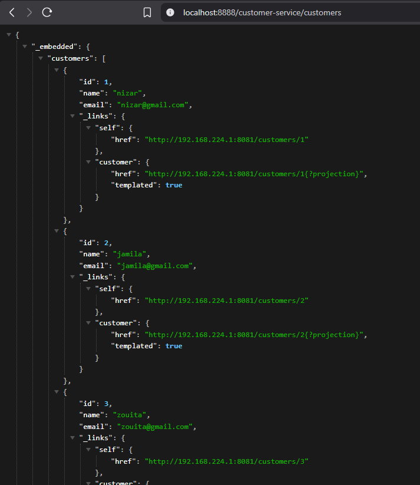
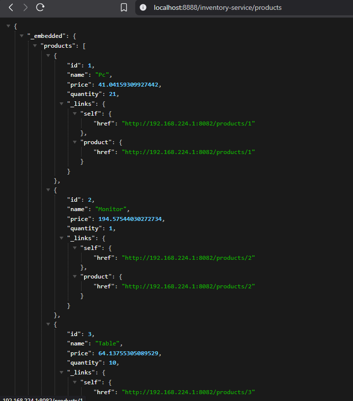

# 🧩 Activité Pratique – Architecture Micro-services (Spring Cloud)

Ce dépôt présente une implémentation complète d’une architecture **Micro-services** avec Spring Cloud.  
Cette activité pratique est réalisée dans le cadre du cours **Architecture Micro-services** encadré par **Mr YOUSSFI Mohamed**.

## 📘 Aperçu du projet

### Architecture Micro-services
- **Objectif** : Construire un système complet permettant de gérer les **clients**, les **produits** et les **factures**.
- **Technologies Utilisées** :
  - Spring Boot  
  - Spring Cloud Gateway  
  - Spring Cloud Eureka Discovery  
  - Spring Cloud Config Server  
  - Spring Cloud OpenFeign  
  - Angular  
  - Spring Actuator  

---

## 🧱 Structure du projet

├── config-service
├── discovery-service
├── gateway-service
├── services
│ ├── customer-service
│ ├── inventory-service
│ └── billing-service
└── angular-client

---

## 📦 Services Backend

### 🧑‍💼 Customer-Service  
Gère les **clients**.

### 📦 Inventory-Service  
Gère les **produits**.

### 🧾 Billing-Service  
Gère les **factures** via **OpenFeign**.

---

## 🌐 Gateway – Spring Cloud Gateway
- Configuration **statique**
- Configuration **dynamique** via Eureka

---

## 🔎 Annuaire Eureka – Discovery-Service  
Permet l’enregistrement automatique des micro-services.

---

## ⚙️ Config-Service + Remote Git Config  
Configuration centralisée avec support :
- `@RefreshScope`
- Actuator `/refresh`

---

## 📸 Captures d’écran

### 🧩 Micro-services – Aperçu Global
| Actuator | Refresh Scope | Bill |
|---|---|---|
|  |  |  |

---

### 🧑‍💼 Customer-Service
| Customers (Liste) | Customer – Profil DEV | Customer – Profil PROD |
|---|---|---|
|  |  |  |

---

### 📦 Inventory-Service via Gateway
| Gateway – Customers Route | Gateway – Products Route |
|---|---|
|  |  |

---

## 🚀 Comment Exécuter le Projet

```bash
# 1️⃣ Lancer le Config-Service
cd config-service && mvn spring-boot:run

# 2️⃣ Lancer le Discovery-Service
cd ../discovery-service && mvn spring-boot:run

# 3️⃣ Lancer la Gateway
cd ../gateway-service && mvn spring-boot:run

# 4️⃣ Lancer les Micro-services
cd ../services/customer-service && mvn spring-boot:run
cd ../inventory-service && mvn spring-boot:run
cd ../billing-service && mvn spring-boot:run

# 5️⃣ Lancer le Client Angular
cd ../../angular-client && npm install && ng serve -o
